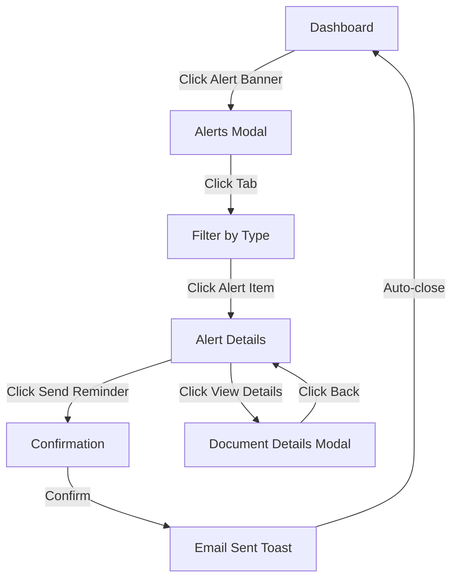
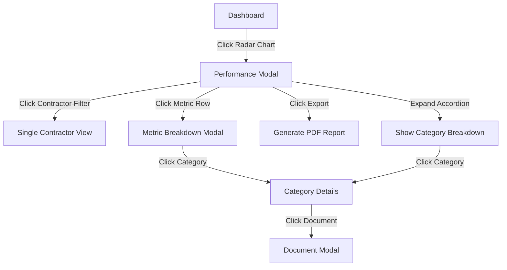
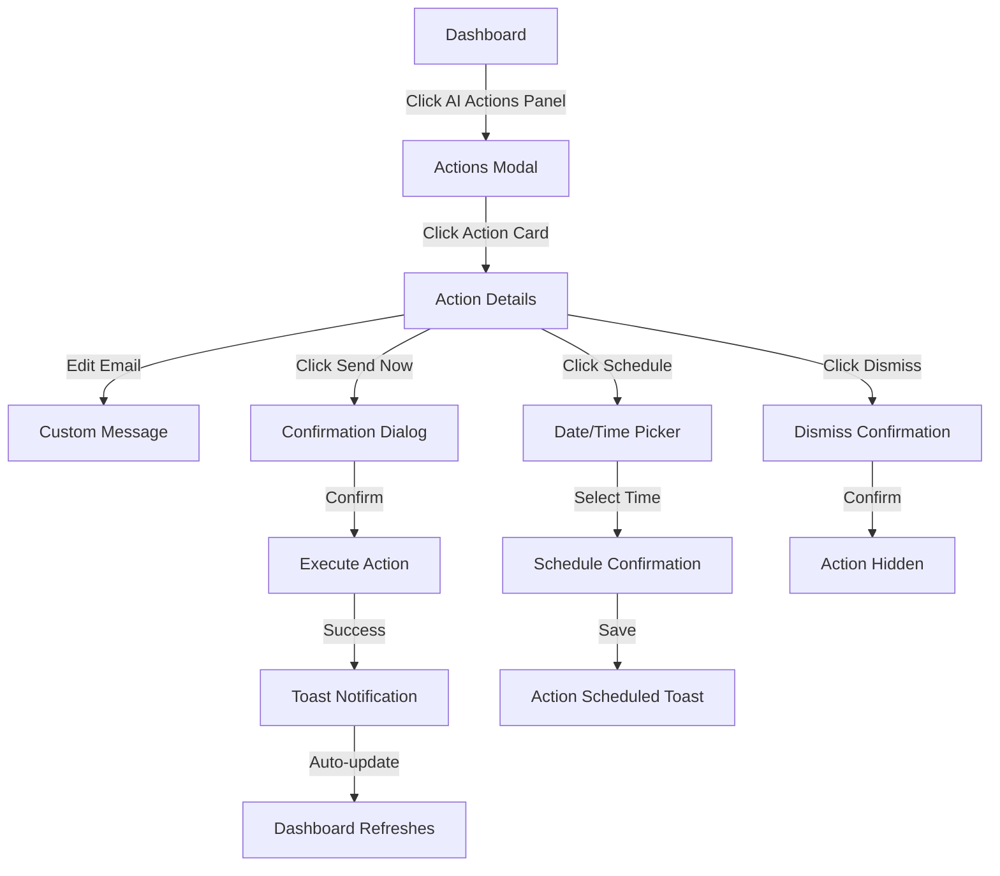
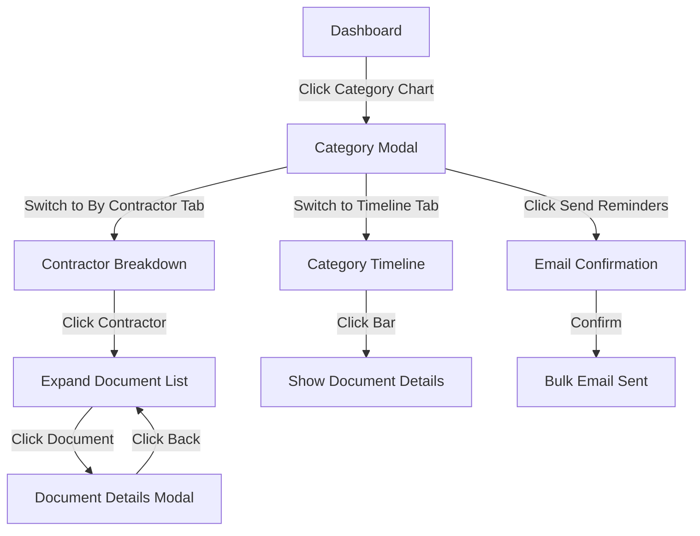

# 🎭 Modal Flow & Interaction Guide v2.0
**Version:** 2.0  
**Date:** 2025-10-29  
**Purpose:** Complete UX flow documentation for dashboard modals

---

## 🎯 Modal System Overview

```
Dashboard (Level 1)
    ↓ Click chart
Modal (Level 2)
    ↓ Click item
Action Panel (Level 3)
```

**Design Principles:**
- **Progressive Disclosure:** Show summary → Show details → Show actions
- **Context Preservation:** Modal shows where it came from
- **Quick Actions:** Critical actions available immediately
- **Escape Hatches:** Always provide way to go back or close

---

## 📋 Complete Modal Flows

### **Flow 1: Alert Management** 🚨

#### **Entry Points:**
1. Click Alert Banner (top of page)
2. Click "View All" button in Alert Banner
3. Click Red Cards KPI card (if implemented)

#### **Modal Structure:**

```
┌─────────────────────────────────────────────┐
│ 🚨 Critical Alerts                    [✕]  │
├─────────────────────────────────────────────┤
│ [Blocking (3)] [Overdue (7)] [Missing (5)] │ ← Tabs
├─────────────────────────────────────────────┤
│                                             │
│ ┌─────────────────────────────────────────┐ │
│ │ 🔴 BLOCKING | Contractor B              │ │
│ │ Safety Plan - Excavation Method         │ │
│ │ ⚠️ Impact: Cannot start foundation work │ │
│ │ Required by: Nov 5, 2025 (7 days over) │ │
│ │                                         │ │
│ │ [Send Reminder] [View Details]         │ │ ← Actions
│ └─────────────────────────────────────────┘ │
│                                             │
│ ┌─────────────────────────────────────────┐ │
│ │ 🔴 BLOCKING | Contractor A              │ │
│ │ Environmental Impact Assessment         │ │
│ │ ... (more alerts)                       │ │
│ └─────────────────────────────────────────┘ │
│                                             │
├─────────────────────────────────────────────┤
│ [📧 Email All Contractors] [📥 Export]     │ ← Footer actions
└─────────────────────────────────────────────┘
```

#### **User Journey:**



#### **Actions Available:**

| Action | Location | Behavior | Result |
|--------|----------|----------|--------|
| **Send Reminder** | Individual alert | Click → Confirmation dialog | Email sent, alert marked "reminder sent" |
| **View Details** | Individual alert | Click → Opens document modal | Shows full doc info + history |
| **Email All** | Footer | Click → Confirmation + email preview | Bulk email to all contractors |
| **Export** | Footer | Click → Download CSV/PDF | Alert list downloaded |
| **Switch Tab** | Tabs | Click → Filter view | Show only selected severity |

#### **States:**

```typescript
interface Alert {
  id: string;
  severity: 'blocking' | 'overdue' | 'missing';
  contractor: string;
  documentName: string;
  category: string;
  impact: string;
  deadline: Date;
  daysOverdue?: number;
  reminderSent?: Date; // Track if reminder already sent
}
```

---

### **Flow 2: Contractor Performance Deep Dive** 🎯

#### **Entry Points:**
1. Click Radar Chart
2. Click Ranking Card
3. Click any contractor name in other charts

#### **Modal Structure:**

```
┌─────────────────────────────────────────────────────┐
│ 🎯 Contractor Performance Details          [✕]     │
├─────────────────────────────────────────────────────┤
│ [View All 3] [Contractor A] [Contractor B] [C]     │ ← Contractor selector
├─────────────────────────────────────────────────────┤
│                                                     │
│ ┌─────────────┬─────────────────────────────────┐  │
│ │  RADAR      │  METRICS TABLE                  │  │
│ │  CHART      │  ┌──────────┬────┬────┬────┐   │  │
│ │             │  │ Metric   │ A  │ B  │ C  │   │  │
│ │   [Chart]   │  ├──────────┼────┼────┼────┤   │  │
│ │             │  │ Complete │92% │65% │78% │   │  │
│ │             │  │ On-time  │88% │72% │85% │   │  │
│ │             │  │ Quality  │95% │68% │82% │   │  │
│ │             │  └──────────┴────┴────┴────┘   │  │
│ └─────────────┴─────────────────────────────────┘  │
│                                                     │
│ ┌───────────────────────────────────────────────┐  │
│ │ 🎯 Key Insights                               │  │
│ │ ✓ Top: Contractor A (92% avg)                │  │
│ │ ⚠ Attention: Contractor B (low compliance)   │  │
│ │ 📈 Improve: Contractor C (response time)     │  │
│ └───────────────────────────────────────────────┘  │
│                                                     │
│ ▼ Detailed Breakdown by Category                   │ ← Accordion (collapsed)
│                                                     │
├─────────────────────────────────────────────────────┤
│ [📊 Export Report] [Compare All 3]                 │
└─────────────────────────────────────────────────────┘
```

#### **User Journey:**



#### **Interactive Elements:**

| Element | Interaction | Result |
|---------|-------------|--------|
| **Contractor Selector** | Click button | Filter to show selected contractor(s) only |
| **Radar Chart** | Hover data point | Tooltip shows exact score |
| **Metrics Table Row** | Click row | Opens metric breakdown by category |
| **Key Insights Card** | Click card | Filters dashboard to that contractor |
| **Accordion** | Click to expand | Shows detailed category-by-category table |
| **Export Button** | Click | Downloads PDF with all metrics + charts |

#### **Dynamic Behavior:**

```typescript
// When user selects contractors
function updateRadarView(selectedContractors: string[]) {
  // 1. Update radar chart
  radarChart.setData(
    contractors.filter(c => selectedContractors.includes(c.id))
  );
  
  // 2. Update metrics table columns
  metricsTable.setColumns(selectedContractors);
  
  // 3. Update insights
  insights.generate(selectedContractors);
  
  // 4. Animate transition
  animateChartTransition(300);
}
```

---

### **Flow 3: AI Actions Execution** 🤖

#### **Entry Points:**
1. Click AI Actions Panel
2. Click individual action card
3. Click "Take Action" in Alert Banner

#### **Modal Structure:**

```
┌─────────────────────────────────────────────┐
│ 🤖 AI Recommended Actions            [✕]   │
├─────────────────────────────────────────────┤
│ AI-generated recommendations based on       │
│ current bottlenecks and delays              │
├─────────────────────────────────────────────┤
│                                             │
│ ┌─────────────────────────────────────────┐ │
│ │ 📧 Send Deadline Reminder     🚨 URGENT │ │
│ │                                         │ │
│ │ Contractor: Contractor B                │ │
│ │ Related Docs: 5 documents               │ │
│ │ Due Date: Oct 30, 2025                  │ │
│ │ Impact: 🔴 High - Blocking construction │ │
│ │                                         │ │
│ │ ┌─────────────────────────────────────┐ │ │
│ │ │ 📧 Email Preview                    │ │ │
│ │ │ To: contractor-b@example.com        │ │ │
│ │ │ Subject: Urgent: 5 docs overdue     │ │ │
│ │ │                                     │ │ │
│ │ │ [Editable email body text...]       │ │ │ ← Editable!
│ │ └─────────────────────────────────────┘ │ │
│ │                                         │ │
│ │ 📎 Related Documents (5):               │ │
│ │ • Safety Plan - Excavation (7d over)   │ │
│ │ • Quality Checklist (5d over)          │ │
│ │ • ... (click to expand)                │ │
│ │                                         │ │
│ │ [✉️ Send Now] [📅 Schedule] [Dismiss]  │ │ ← Action buttons
│ └─────────────────────────────────────────┘ │
│                                             │
│ ┌─────────────────────────────────────────┐ │
│ │ 👥 Schedule Meeting         ⏰ THIS WEEK│ │
│ │ ... (next action)                       │ │
│ └─────────────────────────────────────────┘ │
│                                             │
└─────────────────────────────────────────────┘
```

#### **User Journey:**



#### **Action Execution Flow:**

```typescript
async function executeAction(actionId: string) {
  // 1. Show loading state
  showLoadingSpinner();
  
  // 2. Call API
  try {
    const result = await api.executeAction(actionId);
    
    // 3. Show success
    showToast({
      type: 'success',
      title: '✅ Action Executed',
      message: `Email sent to ${result.recipients.join(', ')}`,
      duration: 5000
    });
    
    // 4. Update UI
    refreshDashboard();
    
    // 5. Show next action (if any)
    if (result.nextAction) {
      showNextActionPrompt(result.nextAction);
    }
    
  } catch (error) {
    // Show error
    showToast({
      type: 'error',
      title: '❌ Action Failed',
      message: error.message,
      duration: 0 // Stay until dismissed
    });
  } finally {
    hideLoadingSpinner();
  }
}
```

#### **Email Editing:**

```typescript
interface EmailTemplate {
  subject: string;
  body: string;
  editable: boolean;
  variables: {
    contractorName: string;
    documentList: string[];
    deadline: Date;
  };
}

// Allow inline editing
function enableEmailEditing(template: EmailTemplate) {
  const editor = document.getElementById('email-body');
  editor.contentEditable = true;
  editor.addEventListener('input', (e) => {
    template.body = e.target.innerText;
  });
}
```

---

### **Flow 4: Category Deep Dive** 📂

#### **Entry Points:**
1. Click Category Progress Chart
2. Click Bar Chart (contractor comparison)
3. Click Overall KPI Card

#### **Modal Structure:**

```
┌─────────────────────────────────────────────┐
│ 📂 Category Details: Safety Plans    [✕]   │
├─────────────────────────────────────────────┤
│ [Overview] [By Contractor] [Timeline]      │ ← Tabs
├─────────────────────────────────────────────┤
│                                             │
│ ┌──────────┬────────────────────────────┐  │
│ │          │ Stats Grid                 │  │
│ │   75%    │ ┌────────┬────────┐       │  │
│ │ Complete │ │ 12 ✓   │ 3 ⏳   │       │  │
│ │          │ │Approved│Pending │       │  │
│ │ [Ring]   │ ├────────┼────────┤       │  │
│ │          │ │ 1 ❌   │ 2 🔴   │       │  │
│ │          │ │Missing │Overdue │       │  │
│ │          │ └────────┴────────┘       │  │
│ └──────────┴────────────────────────────┘  │
│                                             │
│ 📋 Documents by Contractor                  │
│                                             │
│ Contractor A: ██████████ 100% (5/5) ✓      │
│ Contractor B: █████░░░░░ 50% (3/6) ⚠      │
│ Contractor C: ████████░░ 80% (4/5) ⏳      │
│                                             │
│ [Click contractor to see document list]    │
│                                             │
├─────────────────────────────────────────────┤
│ [Send Reminders] [Export Report]           │
└─────────────────────────────────────────────┘
```

#### **Tab Switching:**

**Overview Tab:**
- Circular progress ring (75%)
- 2×2 stats grid (Approved/Pending/Missing/Overdue)
- Contractor progress bars

**By Contractor Tab:**
```
Contractor A (expanded)
  ✓ Safety Plan - Main Structure (Approved - Oct 15)
  ✓ Safety Plan - Excavation (Approved - Oct 18)
  ✓ Emergency Response Plan (Approved - Oct 20)
  ✓ Worker Safety Training Log (Approved - Oct 22)
  ✓ Equipment Safety Checklist (Approved - Oct 25)

Contractor B (collapsed)
  [Click to expand - 3/6 documents]

Contractor C (collapsed)
  [Click to expand - 4/5 documents]
```

**Timeline Tab:**
- Gantt-style timeline for this category only
- Shows submission → review → approval dates
- Highlights overdue items

#### **User Journey:**



---

### **Flow 5: Timeline Analysis** 📅

#### **Entry Points:**
1. Click Mini Timeline
2. Click Processing Time KPI
3. Click Gantt Chart (if visible)

#### **Modal Structure:**

```
┌───────────────────────────────────────────────────────┐
│ 📅 Full Project Timeline                       [✕]   │
├───────────────────────────────────────────────────────┤
│ [Day] [Week] [Month]  |  [All Contractors ▼]         │
│                          [All Categories ▼]          │
├───────────────────────────────────────────────────────┤
│                                                       │
│ ┌─────────────────────────────────────────────────┐  │
│ │ Contractor │ Submission │ Review │ Approval    │  │
│ ├────────────┼────────────┼────────┼─────────────┤  │
│ │ A          │ ████ 100%  │ ███75% │ ████85%     │  │
│ │ B          │ ██░░ 60% ⚠│ ██50%  │ ██45% ⚠    │  │
│ │ C          │ ████ 85%   │ ███70% │ ███75%      │  │
│ └─────────────────────────────────────────────────┘  │
│                                                       │
│ ┌───────────────────────────────────────────────────┐│
│ │ 📊 Timeline Insights                              ││
│ │ • Contractor A is ahead of schedule               ││
│ │ • Contractor B significantly behind - action needed│
│ │ • Average: 8.5 days (Target: 7 days)             ││
│ └───────────────────────────────────────────────────┘│
│                                                       │
├───────────────────────────────────────────────────────┤
│ [📥 Export Timeline (PDF)] [🖨️ Print View]          │
└───────────────────────────────────────────────────────┘
```

#### **Interactive Features:**

| Interaction | Result |
|-------------|--------|
| **Hover over bar** | Tooltip: "Contractor A - Submission: 15 days, 100% complete" |
| **Click bar** | Opens detail panel showing all documents in that phase |
| **Change view** (Day/Week/Month) | Timeline granularity changes |
| **Filter contractor** | Shows only selected contractor's timeline |
| **Filter category** | Shows only documents of that category |
| **Export** | Downloads PDF with full timeline + insights |

---

## 🎨 Modal Design Patterns

### **Pattern 1: Three-Column Layout**

```
┌─────────────────────────────────────┐
│ Header                              │
├─────────────────────────────────────┤
│ ┌──────┬─────────┬──────────────┐  │
│ │      │         │              │  │
│ │ Left │ Center  │    Right     │  │
│ │ Nav  │ Content │  Sidebar     │  │
│ │      │         │ (optional)   │  │
│ │      │         │              │  │
│ └──────┴─────────┴──────────────┘  │
├─────────────────────────────────────┤
│ Footer Actions                      │
└─────────────────────────────────────┘
```

**Use Cases:**
- Radar Detail Modal (Chart + Table + Insights)
- Category Modal (Stats + Breakdown + Timeline)

### **Pattern 2: Tabbed Content**

```
┌─────────────────────────────────────┐
│ Header                              │
├─────────────────────────────────────┤
│ [Tab 1] [Tab 2] [Tab 3]            │
├─────────────────────────────────────┤
│                                     │
│         Tab Content Area            │
│                                     │
├─────────────────────────────────────┤
│ Footer Actions                      │
└─────────────────────────────────────┘
```

**Use Cases:**
- Alerts Modal (Blocking / Overdue / Missing)
- Category Modal (Overview / By Contractor / Timeline)

### **Pattern 3: Vertical List**

```
┌─────────────────────────────────────┐
│ Header + Filters                    │
├─────────────────────────────────────┤
│ ┌─────────────────────────────────┐ │
│ │ Item 1                          │ │
│ │ [Actions]                       │ │
│ └─────────────────────────────────┘ │
│ ┌─────────────────────────────────┐ │
│ │ Item 2                          │ │
│ │ [Actions]                       │ │
│ └─────────────────────────────────┘ │
│ ┌─────────────────────────────────┐ │
│ │ Item 3                          │ │
│ │ [Actions]                       │ │
│ └─────────────────────────────────┘ │
├─────────────────────────────────────┤
│ Bulk Actions                        │
└─────────────────────────────────────┘
```

**Use Cases:**
- AI Actions Modal
- Alerts List Modal

---

## 🔔 Toast Notifications

### **Success Toast:**
```
┌────────────────────────────────────┐
│ ✅ Action Executed                │
│ Email sent to Contractor B         │
│ [Undo] [View Details]        [✕]  │
└────────────────────────────────────┘
```

**Auto-dismiss:** 5 seconds  
**Position:** Top-right  
**Animation:** Slide in from right

### **Error Toast:**
```
┌────────────────────────────────────┐
│ ❌ Action Failed                  │
│ Network error. Please try again    │
│ [Retry] [Dismiss]            [✕]  │
└────────────────────────────────────┘
```

**Auto-dismiss:** Never (stay until dismissed)  
**Position:** Top-right  
**Animation:** Shake

### **Info Toast:**
```
┌────────────────────────────────────┐
│ ℹ️ Dashboard Updated               │
│ New data loaded                    │
│                              [✕]  │
└────────────────────────────────────┘
```

**Auto-dismiss:** 3 seconds  
**Position:** Bottom-right  
**Animation:** Fade in

---

## 📱 Mobile Modal Adaptations

### **Full-Screen Modals on Mobile:**

```
┌───────────────────┐
│ ← Back      [✕]  │ ← Sticky header
├───────────────────┤
│                   │
│                   │
│   Full Screen     │
│   Content         │
│                   │
│   (Scrollable)    │
│                   │
│                   │
│                   │
├───────────────────┤
│ [Primary Action]  │ ← Sticky footer
│ [Secondary]       │
└───────────────────┘
```

### **Bottom Sheet for Quick Actions:**

```
┌───────────────────┐
│                   │
│   Dashboard       │
│   (Dimmed)        │
│                   │
├───────────────────┤
│ ━━━━━━━           │ ← Drag handle
│ Quick Actions     │
│ • Send Email      │
│ • Schedule        │
│ • Dismiss         │
│ [Cancel]          │
└───────────────────┘
```

**Interactions:**
- Swipe down to dismiss
- Tap outside to close
- Drag handle to adjust height

---

## ⌨️ Keyboard Shortcuts

```
ESC         Close modal
Tab         Navigate between elements
Shift+Tab   Navigate backward
Enter       Activate focused button
Space       Toggle checkbox/radio
Arrow Keys  Navigate lists
Cmd/Ctrl+K  Open search
```

---

## 🎯 Accessibility Requirements

### **Focus Management:**
```typescript
function openModal(modalId: string) {
  // 1. Save current focus
  const previousFocus = document.activeElement;
  
  // 2. Open modal
  modal.open();
  
  // 3. Focus first interactive element
  modal.focusFirstElement();
  
  // 4. Trap focus within modal
  modal.trapFocus();
  
  // 5. On close, restore focus
  modal.onClose(() => {
    previousFocus.focus();
  });
}
```

### **Screen Reader Announcements:**
```html
<div role="dialog" 
     aria-modal="true"
     aria-labelledby="modal-title"
     aria-describedby="modal-description">
  <h2 id="modal-title">Critical Alerts</h2>
  <p id="modal-description">12 critical items require your attention</p>
  
  <!-- Announce dynamic changes -->
  <div role="status" aria-live="polite" aria-atomic="true">
    Email sent successfully
  </div>
</div>
```

---

## 🧪 User Testing Scenarios

### **Scenario 1: Handle Critical Alert**
**Goal:** Send reminder email for overdue document

1. User sees alert banner (3 seconds to notice)
2. Clicks "View All" (1 click)
3. Finds overdue document in list (5 seconds to scan)
4. Clicks "Send Reminder" (1 click)
5. Confirms action (1 click)
6. Sees success toast (immediate feedback)

**Target Time:** <15 seconds  
**Success Criteria:** Email sent, alert updated

### **Scenario 2: Compare Contractor Performance**
**Goal:** Identify which contractor needs attention

1. Looks at Ranking Card (2 seconds)
2. Sees Contractor B is lowest (immediate)
3. Clicks Ranking Card to see details (1 click)
4. Reviews metrics table (10 seconds)
5. Identifies low compliance score (5 seconds)
6. Returns to dashboard to take action

**Target Time:** <20 seconds  
**Success Criteria:** Problem identified

### **Scenario 3: Execute AI Recommendation**
**Goal:** Send automated email to contractor

1. Sees AI Actions panel (immediate, prominent)
2. Reviews urgent action (5 seconds)
3. Clicks action card (1 click)
4. Reviews email preview (10 seconds)
5. Clicks "Send Now" (1 click)
6. Confirms (1 click)
7. Sees success confirmation (immediate)

**Target Time:** <25 seconds  
**Success Criteria:** Email sent, action marked complete

---

**END OF MODAL FLOW DOCUMENTATION**

*For developers: See Technical Specification for implementation details*  
*For designers: See Design Tokens for styling consistency*